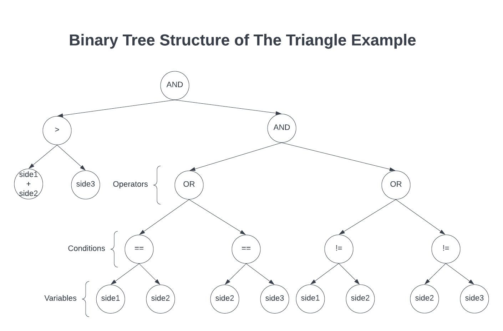
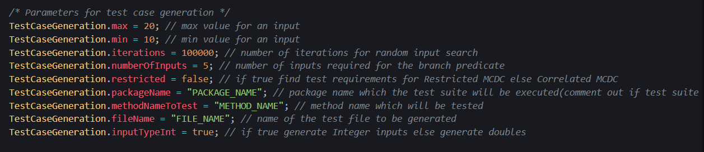
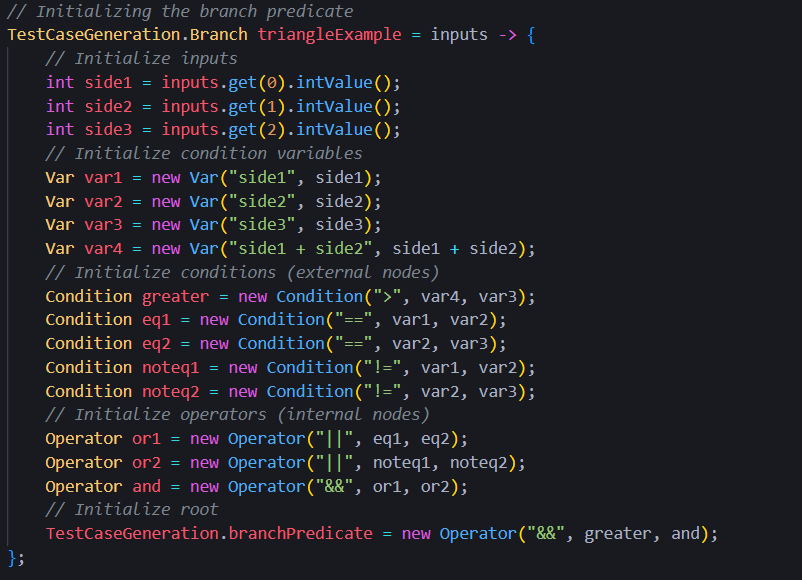
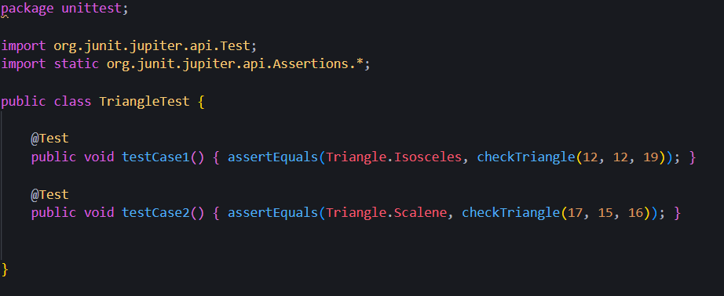

# Java Unit Test Generator Tool 
### Installation:

1. `git clone` the repository
2. Go to the root directory
3. Compile and run `/src/Main.java` and `/src/part1/DataStructureExample.java`

- `Main.java` runs code from both part1 and part2, can be executed to generate test suites for branch predicates.
- `DataStructureExample.java` shows one example of creating the data structure and evaluating it with hard-coded inputs.
- Program works with only integer or double inputs.
- The example in the `DataStructureExample.java` and one of the examples in the `Main.java` is the *Triangle* example and its structure can be illustrated as:

#### Main.java

The parameters here can be changed as desired, however they are required for automatic test case generation and must 
reflect to the data structure with the correct information for instance, number of inputs etc.

A data structure must be created in a `TestCaseGeneration.Branch` interface and `TestCaseGeneration.branchPredicate` must be 
initialized with the root of data structure. An example data structure can be created as following:

### Example test suite generated by the program:

